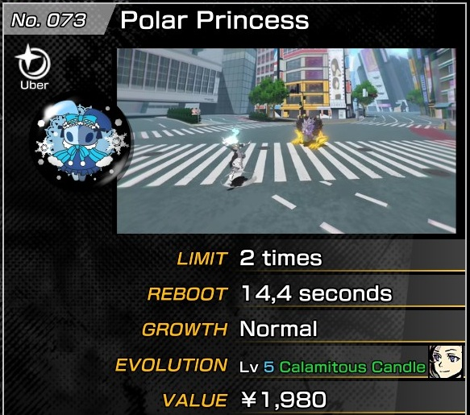
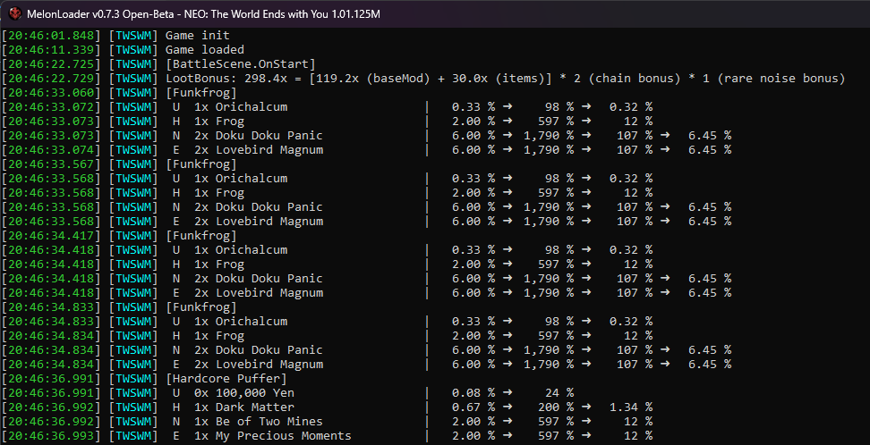

# Neo+ TWEWY Mod

## Features

### Loot System

- **Difficulty-stacked drops**: Roll for lower difficulties as well.
- **Repeated loot rolls**: Keep rolling until first failure.
- **Increased loot cap**: The maximum number of dropped items per battle has been increased from 256 to 4096.

### UI & Quality of Life

- **Detailed evolution info**: The badge description panel now shows the (color-coded) name of the evolved pin (if
  already discovered, or evolution insight has been unlocked).
    - Green: mastered
    - Blue: owned
    - Orange: known
    - Red: unknown

- **Fast skip**: Increased skip speed. Default: 100x (up from 10x)
- **Auto skip**: Automatically enables skip mode in comic scenes. (disabled by default)
- **Interface navigation**: Added navigation hotkeys to certain menus (badge selection, noise reports, shops).
    - Default keys are `PgUp`, `PgDn`, `Home`, `End` (can be changed in config)

### Bug Fixes

- **Mashup boss fix**: Applies the drop rate bonus from Killer Remixes correctly when defeating bosses.
- **New pin fix**: Badges are no longer incorrectly all marked as NEW.

## Requirements

- NEO: The World Ends With You (PC/Steam version)
- MelonLoader

## Installation

1. Download and install [MelonLoader](https://melonwiki.xyz/#/README) in the TWEWY game directory. (The automatic
   installer makes this easy)
2. Run the game once to allow MelonLoader to initialize. It will generate the necessary folders and files.
3. Download the [latest release](https://github.com/aEnigmatic/NeoPlus/releases/latest).
4. Extract the files into the `Mods` folder inside your game directory.

## Configuration

After running the game once, MelonLoader will add the configuration options to `UserData/MelonPreferences.cfg`. You can
then edit that file to tweak the settings, e.g. to enable auto-skip.

Alternatively, you can use
the [MelonPreferencesManager mod](https://github.com/piepieonline/MelonPreferencesManager/releases) to tweak them
in-game (press F5), the mouse cursor is invisible, though.

## Screenshots

   

---

## Building it yourself

You need to create a `Local.props` inside the project directory (next to `NeoPlus.csproj`) and set the path to your game
directory.

See [Local.props.example](Local.props.example)

## License & Acknowledgements

This code is released under the [MIT license](LICENSE).

Third-party libraries bundled at runtime:

* [MinHook.NET](https://github.com/CCob/MinHook.NET) released under
  the [BSD-3-Clause license](https://github.com/CCob/MinHook.NET/blob/master/LICENSE)